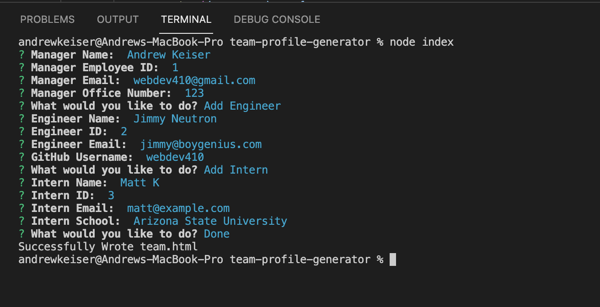
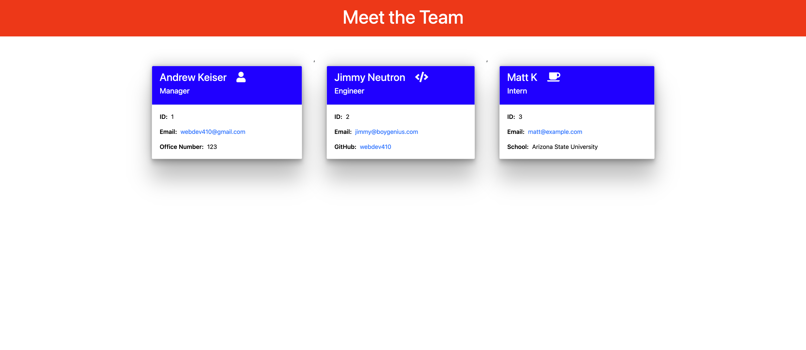

# Team Profile Generator

## Description

This application generates an HTML page for a team profile based on user input.

## Instructions
Before running this application, run `npm install` to load the required assets.

1. This application can be launched in Terminal using the command
	
	node index
	
2. You will be prompted for the Manager's information
3. Next, you will be asked if you'd like to add an Engineer, Intern or if you are done. 
4. Engineer prompts include:

		Engineer Name
		Employee ID Number
		Engineer Email
		GitHub Username
		
5. Intern Prompts include:

		Intern Name
		Intern ID Number
		Intern Email
		School Name
		
6. When "Done" is selected an HTML page will be generated.

## Demo Video

<iframe width="560" height="315" src="https://www.youtube.com/embed/5tVOLMCT5Cs" title="YouTube video player" frameborder="0" allow="accelerometer; autoplay; clipboard-write; encrypted-media; gyroscope; picture-in-picture" allowfullscreen></iframe>

## Screenshots
### Terminal

### Generated HTML page

## Links
[Repo](https://github.com/webdev410/team-profile-generator)
